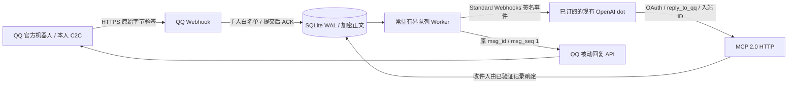

# 架构与安全边界

桥接服务只搬运消息与受限回复，不拥有模型。dot 运行和保留自己的上下文；事件中只有消息 ID、`owner` 标签、原文字及回复截止时间，没有模型权限指令、QQ 私有鉴权字段、回调秘密或记忆。

## 入站与权限

1. 请求体限制 32 KiB；拒绝无效 UTF-8、压缩体与无效 JSON。
2. QQ 原始请求头及原始 body 验签，签名时间最多偏差 300 秒。`op:13` 是官方单独的回调验证入口，只签新鲜、限长的字母数字 challenge，不产生消息权限。
3. 只识别绑定的 AppID/Secret 和一个 `author.user_openid`。主人配置为空时拒绝；不动态配对、自动学习或接受 `*`。
4. 入站 ID、QQ 源事件 ID、签名重放记录、限流及事件 job 在同一 SQLite 事务提交，然后返回 `{op:12,d:0}`。重复已验证消息不会创建新的任务。
5. 没有有效 dot 订阅时返回失败，不存储等待以后导出的陌生历史。

MCP OAuth 主体与 QQ 主人是两种身份，必须由操作者明确绑定。`clientInfo` 是自报元数据，不作为鉴权依据。数据库持久记录 AppID、主人和 MCP 主体；更换任意一项不能复用原数据库。

## 订阅与回调

订阅 ID 由已鉴权主体、回调 URL、事件名及规范化参数确定；仅一个活跃订阅。回调验证完成前不启用。刷新保持 ID，默认寿命一天，同时不超过当前 access token 有效期；到期停止。密钥轮换五分钟双签，验证成功缓存五分钟。

所有出站 HTTPS 都要求指定的确切主机名；回调域名白名单默认为空。每次请求重新解析 DNS，拒绝内网、回环、映射及保留地址，将审核过的 IP 固定到实际连接，同时保留 TLS 主机名校验。禁止重定向、URL 用户名密码、IP 字面量、fragment 和非 443 端口。DNS 和 HTTP 各最多 10 秒，响应最多 256 KiB。没有环境变量可绕过此检查。

## 持久队列与发送语义

SQLite `WAL`、`synchronous=FULL`、事务领取和随机 lease token 保护持久去重与工作领取。部署推荐一个常驻服务实例和本地持久卷；不是多副本分布式数据库架构。

| 类型 | 成功 | 安全重试 | 终止或需人工检查 |
| --- | --- | --- | --- |
| MCP event | 接收器 `2xx` 后 `delivered` | 网络/超时、408、429、5xx；稳定 eventId 和正文，新签名时间；最多 5 次 | 410 撤销订阅，413/3xx/其他拒绝不重试；到期丢弃 |
| QQ reply | JSON 正面回执 ID 后 `sent` | 发消息前的 token 请求失败；明确 HTTP 401/429，仍用原 msg_id/seq | 网络或超时、5xx、缺失回执 ID、进程在发送中中断为 `uncertain`；不自动重发 |

`pending` 表示工具已持久排队，不表示 QQ 收到。`sent` 表示 QQ API 返回消息 ID，不表示主人读到。事件 `2xx` 只表示接收器收到，不表示 dot 已执行或回答。网络无法保证跨 QQ 的绝对 exactly-once；首版优先避免重复，结果不确定时保留给操作者检查。

取消订阅使 pending/processing 任务失效，并在鉴权刷新和 DNS 解析后再次检查权限。已经发到网络上的请求无法撤回；已收到的 QQ 成功回执仍会如实记录。没有回执的已发请求是否到达需人工核实。更改主人配置需停机并按新绑定另建库，禁止将旧消息转交新主人。

默认回复窗口从 QQ 消息 timestamp 起 240 秒、可配置上限 300 秒；领取、工具入队及实际请求前均检查。超过期限不改为主动发送。队列容量 100、入站及回复各每分钟 10 条，状态持久化；限流等待不消耗远端发送重试次数。

## 数据与模型边界

消息/回复正文及回调 URL、secret 用 AES-256-GCM 加密，并以记录类型/ID 作为 AAD。`STORAGE_KEY` 是独立的 32 字节密钥；更换错误密钥会拒绝打开库。身份、消息 ID、时间和状态仍可见，宿主磁盘、文件 ACL 和备份必须受控。

七天后将当前记录中的正文置空；去重 tombstone 长期保留，因此数据库大小仍会增长。历史 WAL 页、磁盘残留及旧备份不承诺被物理擦除，备份保留策略需另设。不要导出数据库作为 dot 记忆，也不要提交 `.env` 或请求体日志。

本桥接的接口无法付款、删除文件或调用其他收件人。它不能控制现有 dot 的其他插件、也不能仅靠工具 annotations 保证模型抗提示注入。QQ 文本中要求扩大权限、导出私有记忆或执行其他外部操作时，确认必须留在 ChatGPT。真正启用前必须审查 dot 的事件任务权限并完成负向验收。
